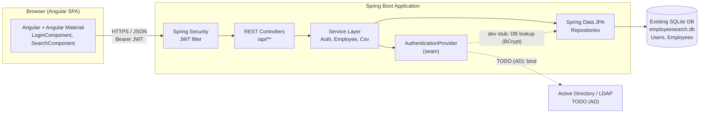
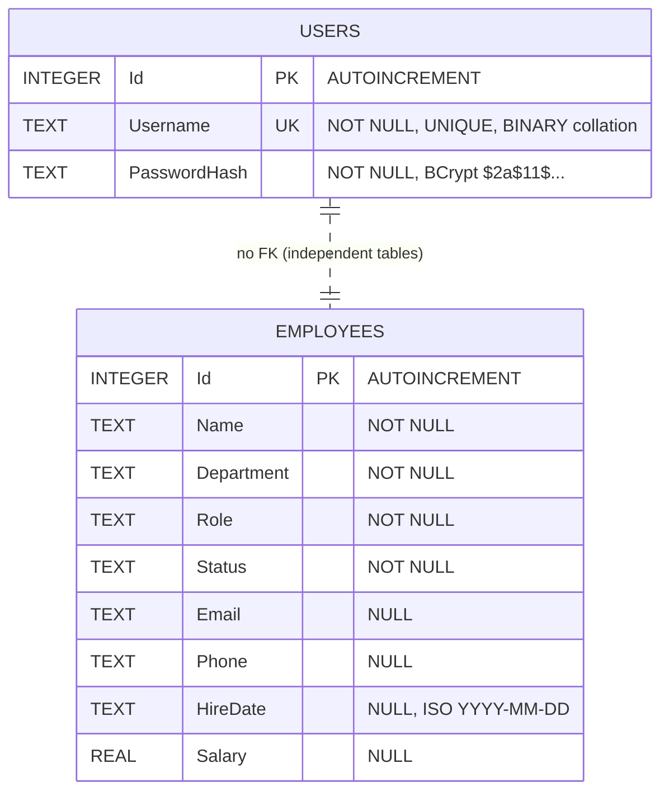
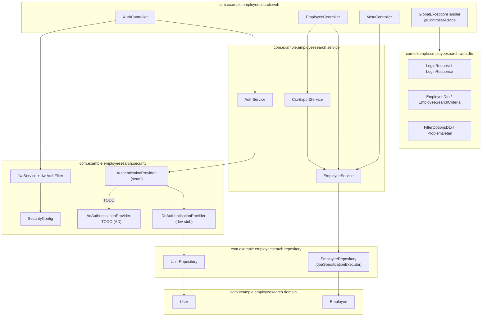
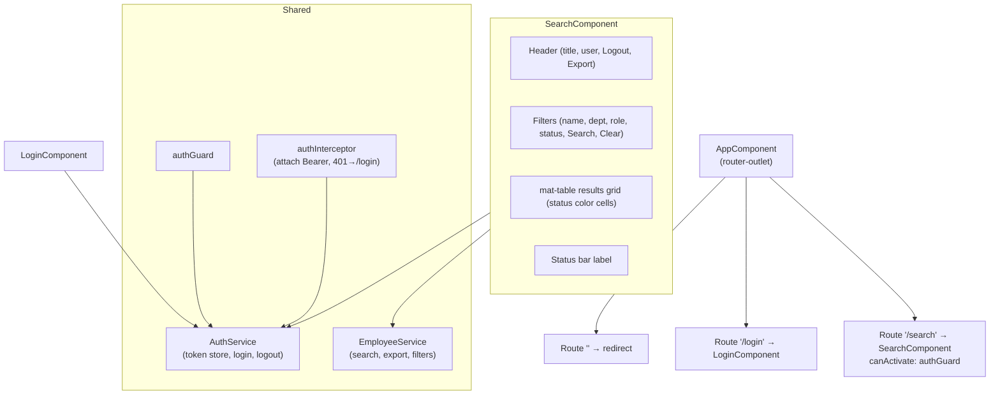
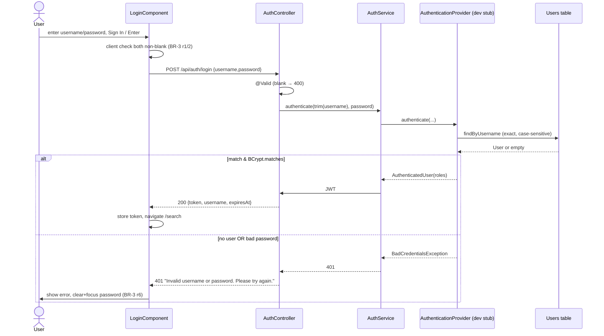

# Design Specification — EmployeeSearch (MT_POC2)

**Document version:** 1.0
**Target stack:** Angular + Angular Material (frontend) · Java 17 / Spring Boot 3.x, Maven, Spring Data JPA, Spring Web, Spring Security (backend) · existing SQLite database reused as-is.
**Source of truth:** [`REQUIREMENTS_MT_POC2.md`](REQUIREMENTS_MT_POC2.md) (all design elements trace to its IDs).
**DB schema confirmed against:** `Database/DatabaseHelper.cs:18–34` (read-only, C1).

> **Golden rule applied:** this designs the *target*. WinForms/.NET structures (Designer files, message loop, `LoggedOut` flag, direct UI→DB calls) are intentionally **not** carried over (see REQUIREMENTS §12). Behavior and business rules are preserved.

---

## Table of Contents

1. [Overview & Scope](#1-overview--scope)
2. [Architecture](#2-architecture)
3. [Technology & Dependencies](#3-technology--dependencies)
4. [Data Design (C1)](#4-data-design-c1)
5. [Backend Design](#5-backend-design)
6. [Frontend Design](#6-frontend-design)
7. [Auth / Authz (C2)](#7-auth--authz-c2)
8. [Integrations](#8-integrations)
9. [Cross-Cutting Concerns](#9-cross-cutting-concerns)
10. [Key Flows (Sequence Diagrams)](#10-key-flows-sequence-diagrams)
11. [Build, Run & Deployment](#11-build-run--deployment)
12. [Open Questions, Risks & Assumptions](#12-open-questions-risks--assumptions)
13. [Traceability Matrix](#13-traceability-matrix)
14. [Implementation Guidance](#14-implementation-guidance)

---

## 1. Overview & Scope

EmployeeSearch is being re-platformed from a single-user Windows desktop app into a browser-based web application with a thin REST backend over the **existing SQLite database**. The web app preserves the two-screen experience (Login, Search) and all observable behavior: authenticate, search/filter an employee directory, color-code status, and export the current result set to CSV.

### 1.1 In Scope

| Item | Trace |
|---|---|
| Login with username/password against existing `Users` table (BCrypt verify) | FR-2, BR-3, §7 |
| Stateless session via JWT issued on login; logout = client token discard | FR-6, FR-7, §12.2 |
| Employee search with Name (partial) + Department/Role/Status (exact) filters, AND-combined, sorted by Name | FR-3, BR-4 |
| Clear filters → re-query all | FR-4 |
| CSV export of current result set, server-generated download | FR-5, EXP-1, BR-7, BR-8 |
| Status color coding in the results grid | BR-5, UI-2 |
| Salary currency display (grid) vs raw numeric (CSV) | BR-6, EXP-1 |
| Fixed dropdown domains for Department/Role/Status | BR-10, A-1 |
| Auth seam ready for Active Directory | §7, C2, TODO (AD) |

### 1.2 Out of Scope (this iteration)

| Item | Reason / Trace |
|---|---|
| User management UI (create/edit/delete users) | OQ-1 — no such feature today; business decision pending |
| Employee create/edit/delete | OQ-3 — directory is read-only today |
| Role-based field restrictions (e.g. salary visibility) | OQ-8, SEC-6 — single implicit role today |
| Account lockout / rate limiting | SEC-3 — not present today; noted as future hardening |
| Live AD/LDAP wiring | C2 — seam + dev stub only; `TODO (AD)` |
| First-run DB seeding | BR-1, BR-2 — seed is a desktop first-run concern; backend uses `ddl-auto=validate` and assumes an existing, populated DB (see §4.4, OQ-9) |

### 1.3 Design Decisions Snapshot (decide, don't defer)

| # | Decision | Rationale |
|---|---|---|
| D1 | Stateless JWT bearer auth, no server session | Web replacement for desktop in-memory `username`; horizontally scalable, no session store (REQUIREMENTS §12.2) |
| D2 | Server-side filtering in SQL (mirror existing predicate logic) | Preserves BR-4 semantics exactly, including `LIKE %x%` |
| D3 | `Salary` mapped as `BigDecimal`, column stays `REAL` | Avoids float rounding in transport/format (BR-6); JPA reads `REAL`→`BigDecimal` cleanly |
| D4 | `HireDate` mapped as `String` (kept as stored text) | Column is `TEXT` with no DB-level format; A-2 says treat as ISO date — formatting done at display, storage contract unchanged (C1) |
| D5 | CSV generated server-side, returned via `Content-Disposition: attachment` | No `SaveFileDialog` in browser; server owns BR-8 quoting + EXP-1 column order |
| D6 | Department/Role/Status options served by a `/meta/filters` endpoint backed by constants | Single source for dropdowns (BR-10); avoids hardcoding twice; future-proofs OQ-6 |
| D7 | DTOs distinct from JPA entities | Decouples API contract from schema; never serialize `PasswordHash` |
| D8 | Username comparison kept case-sensitive | Preserves SQLite BINARY collation behavior (A-4, BR-3) |

---

## 2. Architecture

### 2.1 System Context



*Figure 1 — System context. The Angular SPA talks JSON over HTTPS to Spring Boot, which uses Spring Data JPA against the unchanged SQLite file. Authentication goes through a seam whose dev stub queries the existing `Users` table; AD plugs in later.*

### 2.2 Layering

Strict one-directional dependency: **Controller → Service → Repository → Entity/DB**. DTOs cross the controller boundary; entities never leave the service layer.

| Layer | Responsibility | Must not |
|---|---|---|
| Controller (`web`) | HTTP binding, validation triggering, status codes, DTO in/out | Contain business rules or touch repositories |
| Service (`service`) | Business logic (BR-1…BR-10 semantics), CSV building, auth orchestration | Know about HTTP or JPA query internals |
| Repository (`repository`) | Data access via Spring Data JPA + Specifications | Contain HTTP or formatting logic |
| Entity (`domain`) | JPA mapping onto existing tables (C1) | Be serialized directly to clients |

### 2.3 Cross-Cutting Decisions (summary; detail in §9)

- **Profiles:** `dev` (stub auth, permissive CORS, verbose logging), `prod` (AD seam active, locked CORS).
- **CORS:** allow the Angular origin for `/api/**` (configurable per profile).
- **Error format:** RFC 7807-style JSON problem body, consistent across all endpoints.
- **Validation:** Bean Validation on request DTOs at the controller boundary + service-level invariants.
- **Logging:** SLF4J/Logback; audit log lines for login success/failure, search, export (addresses §12.2 audit gap).

---

## 3. Technology & Dependencies

### 3.1 Backend (Maven)

| Dependency | Version | Purpose |
|---|---|---|
| Java | 17 (LTS) | Language/runtime baseline |
| Spring Boot | 3.3.x | Application framework (BOM-managed versions below) |
| `spring-boot-starter-web` | (BOM) | REST controllers, Jackson |
| `spring-boot-starter-data-jpa` | (BOM) | JPA / Hibernate repositories |
| `spring-boot-starter-security` | (BOM) | Auth filter chain, password encoding |
| `spring-boot-starter-validation` | (BOM) | Bean Validation (Jakarta) |
| `hibernate-community-dialects` | matched to Hibernate 6.x in BOM | Provides `SQLiteDialect` |
| `org.xerial:sqlite-jdbc` | 3.46.x | SQLite JDBC driver |
| `org.springframework.security:spring-security-crypto` | (BOM) | `BCryptPasswordEncoder` (verifies existing `$2a$` hashes) |
| `io.jsonwebtoken:jjwt-api/impl/jackson` | 0.12.x | JWT issue/verify |
| `org.springframework.boot:spring-boot-starter-test` | (BOM) | JUnit 5, Mockito, MockMvc |

> **BCrypt compatibility:** existing hashes use work factor 11, prefix `$2a$` (DatabaseHelper.cs:48). Spring's `BCryptPasswordEncoder.matches()` verifies these without re-hashing (SEC-7 noted; rehash-on-login is out of scope).

### 3.2 Frontend (npm)

| Dependency | Version | Purpose |
|---|---|---|
| Angular | 17.x (standalone components) | SPA framework |
| Angular Material + CDK | 17.x | UI components (table, form-field, select, toolbar, snackbar) |
| RxJS | 7.x | Async streams for HTTP |
| TypeScript | 5.x | Language |

### 3.3 Database

SQLite file `employeesearch.db` (existing). **No schema changes.** Backend connects via `sqlite-jdbc`; Hibernate runs with `ddl-auto=validate` (C1, §4.3).

---

## 4. Data Design (C1)

### 4.1 ER Diagram (existing schema, unchanged)



*Figure 2 — Existing data model. The two tables are independent; there are no foreign keys, triggers, stored procedures, computed columns, or check constraints (REQUIREMENTS §4.5, §4.2). The relationship line denotes only that both are reused — not a referential constraint.*

### 4.2 Table → Entity Mapping

Entity and column names use the **exact DB casing** (C1). Table names `Users`/`Employees` mapped explicitly via `@Table`.

#### Entity: `User` → table `Users`

| Column | DB type | Java field | JPA mapping | Notes |
|---|---|---|---|---|
| `Id` | INTEGER PK AUTOINCREMENT | `Long id` | `@Id @GeneratedValue(strategy = IDENTITY) @Column(name="Id")` | Surrogate key |
| `Username` | TEXT NOT NULL UNIQUE | `String username` | `@Column(name="Username", nullable=false, unique=true)` | Case-sensitive match (A-4) |
| `PasswordHash` | TEXT NOT NULL | `String passwordHash` | `@Column(name="PasswordHash", nullable=false)` | **Never serialized** (no DTO field) |

#### Entity: `Employee` → table `Employees`

| Column | DB type | Java field | JPA mapping | Notes |
|---|---|---|---|---|
| `Id` | INTEGER PK AUTOINCREMENT | `Long id` | `@Id @GeneratedValue(IDENTITY) @Column(name="Id")` | |
| `Name` | TEXT NOT NULL | `String name` | `@Column(name="Name", nullable=false)` | |
| `Department` | TEXT NOT NULL | `String department` | `@Column(name="Department", nullable=false)` | Free text in DB (A-1) |
| `Role` | TEXT NOT NULL | `String role` | `@Column(name="Role", nullable=false)` | Free text in DB (A-1) |
| `Status` | TEXT NOT NULL | `String status` | `@Column(name="Status", nullable=false)` | Free text in DB (A-1) |
| `Email` | TEXT NULL | `String email` | `@Column(name="Email")` | Nullable |
| `Phone` | TEXT NULL | `String phone` | `@Column(name="Phone")` | Nullable, any string (A-5) |
| `HireDate` | TEXT NULL | `String hireDate` | `@Column(name="HireDate")` | **Kept as `String`** (D4); column stays TEXT |
| `Salary` | REAL NULL | `BigDecimal salary` | `@Column(name="Salary")` | Read as `BigDecimal` (D3, BR-6) |

> **D4 rationale:** mapping `HireDate` to `LocalDate` would require Hibernate to coerce the TEXT column and could break `ddl-auto=validate` type checks on some dialects. Keeping it `String` honors C1 exactly; the frontend treats it as an opaque ISO date for display (A-2).

### 4.3 `ddl-auto=validate` Notes

- `spring.jpa.hibernate.ddl-auto=validate` — Hibernate verifies entity↔table agreement at startup and **never** issues DDL (C1).
- SQLite stores types by affinity. `Salary REAL` ↔ `BigDecimal` and `Id INTEGER` ↔ `Long` validate under `SQLiteDialect`. If validation rejects `BigDecimal`↔`REAL` on the chosen dialect version, fall back to `@Column(columnDefinition="REAL")` or `Double` with a service-layer conversion to `BigDecimal` (see Risk R-1).
- `AUTOINCREMENT` PKs map to `GenerationType.IDENTITY`; no sequence tables required.

### 4.4 Mapping Risks

| ID | Risk | Mitigation |
|---|---|---|
| R-1 | `BigDecimal`↔`REAL` validation/precision under `SQLiteDialect` | Verify on startup; fallback to `Double`→`BigDecimal` conversion in `EmployeeService` (BR-6) |
| R-2 | SQLite `LIKE` is ASCII-case-insensitive but Unicode-case-sensitive (BR-4, OQ-4) | Preserve native `LIKE` semantics by issuing the same predicate; document as OQ-4 — do not silently "fix" |
| R-3 | `Username` BINARY case-sensitivity could be lost if a `lower()` comparison is introduced | Use exact `=` match in repository query (A-4, D8) |
| R-4 | Seed data absent in a fresh prod DB (BR-2 seed skipped if any rows) | Out of scope; backend assumes populated DB (OQ-9) |

---

## 5. Backend Design

### 5.1 Package / Component Diagram



*Figure 3 — Backend packages. Controllers depend on services; services on repositories; the auth seam (`AuthenticationProvider`) has a dev stub (`DbAuthenticationProvider`) and an AD placeholder. DTOs are the only types crossing the web boundary.*

### 5.2 REST API Contract

Base path: `/api`. All responses JSON unless noted. All `/api/employees/**` and `/api/meta/**` require a valid `Authorization: Bearer <jwt>`; `/api/auth/login` is public.

| # | Method | Path | Auth | Request | Success | Errors |
|---|---|---|---|---|---|---|
| A1 | POST | `/api/auth/login` | public | `LoginRequest` `{username, password}` (both required) | `200` `LoginResponse` `{token, username, expiresAt}` | `400` blank field (BR-3 r1/2); `401` bad creds (BR-3 r3/4) |
| A2 | POST | `/api/auth/logout` | bearer | none | `204` no content | `401` if no/invalid token |
| E1 | GET | `/api/employees` | bearer | query params `name?`, `department?`, `role?`, `status?` | `200` `EmployeeDto[]` (sorted by Name asc) | `401` |
| E2 | GET | `/api/employees/export` | bearer | same query params as E1 | `200` `text/csv`, header `Content-Disposition: attachment; filename="employees_<yyyyMMdd_HHmmss>.csv"` | `401`; `409` empty result set (BR-7) |
| M1 | GET | `/api/meta/filters` | bearer | none | `200` `FilterOptionsDto` `{departments[], roles[], statuses[]}` (each prefixed with `All`) | `401` |

#### Endpoint semantics

**A1 — Login (FR-2, BR-3, §7).**
- Trim `username`; do **not** trim `password`. If either blank after trim → `400` problem `"Please enter both username and password."`
- Delegate to `AuthService.authenticate(username, password)` → seam. On failure → `401` problem `"Invalid username or password. Please try again."` (same message for unknown user and bad password — prevents enumeration, BR-3 r7).
- On success issue JWT (subject = username, short expiry). Return token + echo username + `expiresAt`.

**A2 — Logout (FR-6).** Stateless: server returns `204`; client discards token. (No server session to invalidate; D1.) `TODO (AD)`: optional token denylist later.

**E1 — Search (FR-3, BR-4).** Query parameters map 1:1 to the desktop filters. Predicate rules (built via JPA `Specification`):
- `name` non-blank → `LIKE %trim(name)%` (case behavior per R-2/OQ-4).
- `department`/`role`/`status` non-blank **and** ≠ `"All"` → exact `=`.
- Combine active predicates with `AND`; always `ORDER BY name ASC`.
- Absent/blank/`All` params → no predicate (returns all). Empty filter set returns all rows.

**E2 — Export (FR-5, EXP-1, BR-7, BR-8).**
- Re-run the E1 query with the same params (export = current result set, EXP-1 scope).
- If zero rows → `409 Conflict` problem `"There are no rows to export."` (mirrors BR-7 guard; frontend shows the message).
- Else stream CSV: header row then data rows in EXP-1 column order; `Salary` written as **raw numeric** (no currency format, EXP-1 col 9); BR-8 quoting; CRLF line endings.
- Filename timestamp = server local time at request (OQ-7 noted). UTF-8 encoding; **no BOM** (resolves OQ-5 toward standard CSV — see §12).

**M1 — Filter options (BR-10, D6).** Returns the fixed domains so the SPA never hardcodes them:
```json
{
  "departments": ["All","Finance","HR","IT","Marketing","Operations"],
  "roles":       ["All","Analyst","Coordinator","Designer","Developer","Manager"],
  "statuses":    ["All","Active","Inactive","On Leave"]
}
```

### 5.3 DTOs

| DTO | Fields | Notes |
|---|---|---|
| `LoginRequest` | `@NotBlank String username`, `@NotBlank String password` | Validation = BR-3 r1/2 (blank check) |
| `LoginResponse` | `String token`, `String username`, `Instant expiresAt` | No password/hash |
| `EmployeeDto` | `Long id`, `String name`, `String department`, `String role`, `String status`, `String email`, `String phone`, `String hireDate`, `BigDecimal salary` | `salary` raw numeric; formatting is frontend concern (BR-6). No `salaryFormatted` field — display formatting belongs to UI |
| `EmployeeSearchCriteria` | `String name`, `String department`, `String role`, `String status` | Bound from query params |
| `FilterOptionsDto` | `List<String> departments/roles/statuses` | D6 |
| `ProblemDetail` (Spring) | `type`, `title`, `status`, `detail` | RFC 7807 error body |

> **Salary in transport:** sent as a JSON number (BigDecimal). The grid applies currency formatting client-side (BR-6); the CSV uses the raw number server-side (EXP-1). This cleanly separates the two desktop behaviors that previously diverged via `SalaryFormatted`.

### 5.4 Services

- **`AuthService`** — orchestrates login: blank validation already enforced by DTO; calls the `AuthenticationProvider` seam; on success asks `JwtService` to mint a token. Emits audit log entries (success/failure with username, no password).
- **`EmployeeService`** — builds the `Specification<Employee>` from `EmployeeSearchCriteria` (BR-4), executes via `EmployeeRepository`, maps `Employee`→`EmployeeDto`. Single source of the search predicate (reused by E1 and E2).
- **`CsvExportService`** — takes `List<EmployeeDto>`, produces CSV bytes implementing BR-8 quoting + EXP-1 column order/order-of-fields; throws `EmptyExportException` when list empty (→ `409`).

### 5.5 Repositories

- **`UserRepository extends JpaRepository<User,Long>`** — `Optional<User> findByUsername(String username)` (exact, case-sensitive; A-4/D8).
- **`EmployeeRepository extends JpaRepository<Employee,Long>, JpaSpecificationExecutor<Employee>`** — search via Specifications; static factory methods in an `EmployeeSpecifications` helper (`nameLike`, `departmentEquals`, `roleEquals`, `statusEquals`).

### 5.6 Validation Placement

| Rule | Where | Trace |
|---|---|---|
| Username/password non-blank | DTO `@NotBlank` (controller boundary) | BR-3 r1/2 |
| Credentials match | `AuthenticationProvider` (service/security) | BR-3 r3/4 |
| Filter `"All"`/blank → ignore | `EmployeeService` spec builder | BR-4 |
| Export non-empty | `CsvExportService` | BR-7 |

### 5.7 Error Handling

`@RestControllerAdvice GlobalExceptionHandler` maps exceptions to RFC 7807 `ProblemDetail`:

| Exception | Status | `detail` |
|---|---|---|
| `MethodArgumentNotValidException` (blank login field) | 400 | `"Please enter both username and password."` |
| `BadCredentialsException` | 401 | `"Invalid username or password. Please try again."` |
| `AuthenticationException` (missing/expired JWT) | 401 | `"Authentication required."` |
| `EmptyExportException` | 409 | `"There are no rows to export."` |
| Uncaught `Exception` | 500 | `"An unexpected error occurred."` (details logged, not leaked) |

> Replaces the desktop's *no try/catch / crash-on-error* behavior (REQUIREMENTS §10.5 FLAG).

---

## 6. Frontend Design

### 6.1 Component & Routing Tree



*Figure 4 — Frontend component & routing tree. Two routed screens map to the two desktop windows; `authGuard` + `authInterceptor` replace the desktop login/search loop and `LoggedOut` flag (REQUIREMENTS §12).*

### 6.2 Screen — Login (UI-1, FR-2)

| Aspect | Spec |
|---|---|
| Component / route | `LoginComponent` / `/login` |
| Fields | `username` (text, autofocus), `password` (`<input type="password">`, masking replaces `UseSystemPasswordChar`) |
| Actions | **Sign In** button; Enter in either field submits (FR-2 trigger) |
| Validation | Both required; empty → inline error `"Please enter both username and password."` (BR-3 r1/2), checked client-side and server-side |
| States | *idle* · *submitting* (button disabled/spinner) · *error* (red message, password cleared + refocused, BR-3 r6) · *success* (store token, navigate `/search`) |
| APIs | `POST /api/auth/login` (A1) |
| Visual | Card-centered layout; gradient background reproduced with CSS `linear-gradient(135deg, #1B2A4A, #2B5278)`. **SEC-1:** the desktop "Default credentials" hint is **omitted** (security fix; OQ in §12) |

### 6.3 Screen — Search (UI-2, FR-3…FR-6)

| Aspect | Spec |
|---|---|
| Component / route | `SearchComponent` / `/search` (guarded) |
| Header | Title `🔍 Employee Search`; `Logged in as: <username>`; **Logout** (clears token → `/login`, FR-6); **Export** (FR-5) |
| Filters | `name` text (Enter triggers search, FR-3); `department`, `role`, `status` as `mat-select` (DropDownList equivalent, options from M1, default `All`, BR-10); **Search** button; **Clear** button (FR-4) |
| Results grid | `mat-table`, columns in order: `#`(id), Name, Department, Role, Status, Email, Phone, Hire Date, Salary. Read-only, single-row select. **Status cell** colored per BR-5 mapping. **Salary** formatted client-side as currency, no decimals (BR-6) via Angular `currency` pipe / `CurrencyPipe` |
| Status bar | Label updated after each search/export: 0→`"No employees match the selected filters."`, 1→`"1 employee found."`, N→`"N employees found."` (FR-3); export→`"Exported N employee(s) to <filename>.csv."` (FR-5). Initial text `"Use filters above and click Search to find employees."` |
| Behavior on load | Auto-execute search with no filters (returns all, FR-3 trigger a) |
| Clear | Reset name + three selects to `All`, re-run search (FR-4) |
| Export empty-guard | If current results empty, Export shows snackbar `"There are no rows to export."` without calling server, OR relies on `409` response message — **decision:** client checks current result length first (mirrors BR-7), avoiding a needless request |
| APIs | `GET /api/employees` (E1), `GET /api/employees/export` (E2), `GET /api/meta/filters` (M1) |

#### Status color mapping (BR-5) — frontend constant

| Status | Background | Foreground |
|---|---|---|
| `Active` | `#D1FAE5` | `#065F46` |
| `Inactive` | `#FEE2E2` | `#991B1B` |
| `On Leave` | `#FEF3C7` | `#92400E` |
| *(other)* | `#E5E7EB` | `#374151` |

### 6.4 Frontend Services

- **`AuthService`** — `login()`, `logout()`, token storage (in-memory + `sessionStorage` for reload survival), `isAuthenticated()`, `currentUsername()`.
- **`EmployeeService`** — `search(criteria): Observable<EmployeeDto[]>`, `export(criteria)` (triggers browser download from the response blob + `Content-Disposition` filename), `getFilterOptions()`.
- **`authInterceptor`** — attaches `Authorization: Bearer`; on `401` clears token and redirects to `/login`.
- **`authGuard`** — blocks `/search` when unauthenticated.

> **Export download:** since browsers can't use `SaveFileDialog`, `EmployeeService.export()` issues the GET, reads the blob + filename from `Content-Disposition`, and programmatically clicks an object-URL anchor (browser download). Replaces FR-5 file picker; server owns filename/timestamp.

---

## 7. Auth / Authz (C2)

### 7.1 The Auth Seam

```mermaid
flowchart LR
    AC["AuthController"] --> AS["AuthService"]
    AS --> IFACE["interface AuthenticationProvider<br/>authenticate(username, password) : AuthenticatedUser"]
    IFACE -->|@Profile dev / default| STUB["DbAuthenticationProvider<br/>UserRepository + BCryptPasswordEncoder"]
    IFACE -.->|@Profile prod, TODO AD| ADP["AdAuthenticationProvider<br/>LDAP bind (not implemented)"]
    STUB --> UR["UserRepository → Users table"]
```

*Figure 5 — Auth seam. `AuthService` depends only on the `AuthenticationProvider` interface. The dev stub verifies against the existing `Users` table with BCrypt; the AD implementation is a profiled placeholder (C2, TODO (AD)).*

- **Interface:** `AuthenticationProvider { AuthenticatedUser authenticate(String username, String rawPassword); }` returning username + granted roles, or throwing `BadCredentialsException`.
- **Dev stub — `DbAuthenticationProvider`** (active under `dev`/default profile): `findByUsername` (exact/case-sensitive, A-4) → `BCryptPasswordEncoder.matches(rawPassword, passwordHash)` (verifies existing `$2a$11$` hashes, BR-3 r3/4). Grants role `ROLE_EMPLOYEE_VIEWER`.
- **AD placeholder — `AdAuthenticationProvider`** (`prod` profile): method body `// TODO (AD): bind to AD/LDAP, map group → role`. No LDAP config committed (C2).

### 7.2 Token & Enforcement

- On success, `JwtService` mints a signed JWT (subject=username, claim `roles`, short expiry).
- `JwtAuthFilter` validates the bearer token on each `/api/**` (except `/api/auth/login`), populating the `SecurityContext`.
- `SecurityConfig`: stateless session policy; `/api/auth/login` permitAll; all other `/api/**` `authenticated()`. Method-level `@PreAuthorize("hasRole('EMPLOYEE_VIEWER')")` on employee/meta endpoints.

### 7.3 Role → AD-Group Mapping

| App role (AD-mappable) | AD group (placeholder) | Grants | Trace |
|---|---|---|---|
| `EMPLOYEE_VIEWER` | `EmployeeSearch-Users` | Search, export, view all employee fields incl. salary | §7.2 single implicit role; SEC-6/OQ-8 future split |

> **TODO (AD):** when AD lands, map AD security groups to app roles in `AdAuthenticationProvider`; future salary-restriction role (OQ-8) would add `EMPLOYEE_VIEWER_NO_SALARY` and field-level filtering — out of scope now.

### 7.4 Security Improvements Adopted vs. Deferred

| Item | Decision | Trace |
|---|---|---|
| Remove default-credentials hint from UI | **Adopted** (omit `lblHint`) | SEC-1 |
| Same error for unknown user/bad password | **Adopted** | BR-3 r7 |
| HTTPS/TLS at transport | **Adopted** (deployment, §11) | §12.2 |
| Account lockout / rate limit | Deferred | SEC-3, §1.2 |
| Session expiry | JWT short expiry provides bounded session | SEC-4 |
| DB-at-rest encryption | Deferred (infra concern) | SEC-5 |
| Rehash on higher cost | Deferred | SEC-7 |

---

## 8. Integrations

**None** beyond the database and the CSV download. No external APIs, email, queues, or SMTP (REQUIREMENTS §8). The only "integration" seam is the future AD provider (§7, C2). CSV "export" is an HTTP response, not an external system call.

---

## 9. Cross-Cutting Concerns

| Concern | Decision |
|---|---|
| **Profiles** | `dev` (default): `DbAuthenticationProvider`, permissive CORS, DEBUG logging. `prod`: `AdAuthenticationProvider` (TODO), strict CORS, INFO logging. |
| **CORS** | `CorsConfigurationSource` allowing the Angular origin (`http://localhost:4200` dev) for `/api/**`, methods GET/POST, `Authorization` header. Origins externalized to config (REQUIREMENTS §12.2). |
| **Configuration** | `application.yml` + profile overlays. DB URL, JWT secret/expiry, CORS origins via env vars (§11). Resolves OQ-10 (DB path now configurable). |
| **Logging / Audit** | Logback via SLF4J. Audit logger records: login success/failure (username, timestamp, outcome), search (criteria, result count), export (count, filename). No passwords/hashes logged. Addresses §12.2 audit gap and §10.6. |
| **Error handling** | Centralized `@RestControllerAdvice` (§5.7); no unhandled crash path (fixes §10.5). |
| **Validation** | Bean Validation at controller boundary + service invariants (§5.6). Server-side validation added (was client-only, §12.2). |
| **Statelessness** | No server session; criteria/results are request-scoped; SPA holds current results in component state (replaces `_currentResults`/`_username` fields, §12.2). |
| **Pagination** | Not implemented this iteration (15-row dataset, FR-3 has none). API shape (`EmployeeDto[]`) leaves room to evolve to a paged envelope later (OQ-2). |
| **Locale** | Salary currency formatting done client-side via Angular `CurrencyPipe` with the app locale; `HireDate` displayed as stored ISO text (REQUIREMENTS §10.4, A-2). |

---

## 10. Key Flows (Sequence Diagrams)

### 10.1 Login (FR-2, BR-3, §7)



### 10.2 Search (FR-3, BR-4)

```mermaid
sequenceDiagram
    actor U as User
    participant S as SearchComponent
    participant API as EmployeeController
    participant ES as EmployeeService
    participant R as EmployeeRepository
    participant DB as Employees table

    U->>S: set filters, Search / Enter (or screen load)
    S->>API: GET /api/employees?name=&department=&role=&status=
    API->>ES: search(criteria)
    ES->>ES: build Specification (ignore blank/"All"; LIKE for name; AND)
    ES->>R: findAll(spec, sort=Name asc)
    R->>DB: SELECT ... WHERE ... ORDER BY Name
    DB-->>R: rows
    R-->>ES: List<Employee>
    ES-->>API: List<EmployeeDto>
    API-->>S: 200 EmployeeDto[]
    S->>U: render grid (status colors, salary currency), update status bar count
```

### 10.3 Export (FR-5, EXP-1, BR-7, BR-8)

```mermaid
sequenceDiagram
    actor U as User
    participant S as SearchComponent
    participant API as EmployeeController
    participant ES as EmployeeService
    participant CS as CsvExportService

    U->>S: click Export
    alt current results empty (client guard, BR-7)
        S->>U: snackbar "There are no rows to export."
    else has rows
        S->>API: GET /api/employees/export?<same filters>
        API->>ES: search(criteria)
        ES-->>API: List<EmployeeDto>
        alt list empty (server guard)
            API-->>S: 409 "There are no rows to export."
            S->>U: snackbar with message
        else
            API->>CS: toCsv(list)  %% EXP-1 columns, BR-8 quoting, raw salary, CRLF
            CS-->>API: csv bytes
            API-->>S: 200 text/csv + Content-Disposition filename
            S->>U: browser download; status bar "Exported N employee(s) to <file>.csv."
        end
    end
```

> **State diagram:** omitted — the app has no meaningful multi-state workflow beyond authenticated/unauthenticated, which the login sequence and `authGuard` already capture (per DESIGN_INSTRUCTIONS §"State diagram — only if there's meaningful workflow").

---

## 11. Build, Run & Deployment

### 11.1 Backend

- **Build:** `mvn clean package` → executable Spring Boot jar.
- **Run:** `java -jar employeesearch-api.jar --spring.profiles.active=dev`.
- **Connect to existing DB (config shape, not secrets):**

```yaml
# application.yml (values via env vars)
spring:
  datasource:
    url: jdbc:sqlite:${DB_PATH:./employeesearch.db}   # OQ-10: now configurable
    driver-class-name: org.sqlite.JDBC
  jpa:
    hibernate:
      ddl-auto: validate            # C1 — never create/update
    properties:
      hibernate.dialect: org.hibernate.community.dialect.SQLiteDialect
app:
  jwt:
    secret: ${JWT_SECRET}           # injected, never committed
    expiry-minutes: ${JWT_EXPIRY:60}
  cors:
    allowed-origins: ${CORS_ORIGINS:http://localhost:4200}
```

### 11.2 Frontend

- **Build:** `npm install && ng build --configuration production`.
- **Run (dev):** `ng serve` on `http://localhost:4200`; `environment.ts` sets `apiBaseUrl=http://localhost:8080/api`.
- **Deploy:** serve `dist/` static assets behind the same origin/reverse proxy as the API (TLS terminated at proxy, §7.4).

### 11.3 Deployment Topology

Single Spring Boot service + static Angular bundle (optionally served by the same app or a reverse proxy). The SQLite file is mounted on a path readable/writable by the backend process; for true multi-user concurrency a future migration to a networked DB is flagged (OQ-2, REQUIREMENTS §12.2, R-4). HTTPS terminated at the proxy.

---

## 12. Open Questions, Risks & Assumptions

### 12.1 Open Questions (carried from requirements + design-surfaced)

| ID | Question | Design stance |
|---|---|---|
| OQ-1 | Permanent single admin vs. user management? | Out of scope; auth seam tolerates either |
| OQ-2 | Real dataset size / pagination? | No pagination now; DTO array can evolve to paged envelope |
| OQ-3 | Editable directory? | Read-only now; no write endpoints designed |
| OQ-4 | `LIKE` ASCII-only case-insensitivity intended? | Preserve native SQLite `LIKE` (R-2); flagged, not "fixed" |
| OQ-5 | CSV UTF-8 BOM intentional? | **Design decision:** emit **no BOM** (standard CSV). Revisit if Excel-on-Windows compatibility requires BOM |
| OQ-6 | Are Department/Role/Status closed enums? | Served from `/meta/filters` constants (A-1); easy to swap for a lookup table later |
| OQ-7 | Export timestamp UTC vs local? | Server **local** time (matches desktop `DateTime.Now`); revisit for multi-TZ deployments |
| OQ-8 | Salary visible to all roles? | Yes for now (single role); field-level restriction deferred |
| OQ-9 | Seed data required in prod? | Backend assumes pre-populated DB; no seeding |
| OQ-10 | DB path configuration in web env? | Resolved via `DB_PATH` env var (§11) |
| **DQ-1 (new)** | Should the removed "default credentials" UI hint (SEC-1) ever reappear in a dev-only banner? | Recommend permanently omitted; confirm with stakeholders |

### 12.2 Risks

See §4.4 (R-1…R-4). Additional: JWT secret management (must be injected, never committed); SQLite single-writer concurrency under multi-user web load (R-4, OQ-2).

### 12.3 Assumptions (from requirements)

A-1 (closed Department/Role/Status domains), A-2 (`HireDate` ISO date-only), A-3 (`Salary` annual, locale currency), A-4 (case-sensitive username), A-5 (`Phone` free-form). All carried unchanged.

---

## 13. Traceability Matrix

| Requirement ID | Design element(s) |
|---|---|
| FR-1 (startup/init) | Backend assumes existing DB; `ddl-auto=validate` (§4.3); seeding out of scope (§1.2, OQ-9) |
| FR-2 (login) | A1 endpoint (§5.2), LoginComponent (§6.2), §7, flow §10.1 |
| FR-3 (search) | E1 endpoint (§5.2), `EmployeeService` spec (§5.4), SearchComponent grid (§6.3), flow §10.2 |
| FR-4 (clear) | SearchComponent Clear action (§6.3) |
| FR-5 (export) | E2 endpoint (§5.2), `CsvExportService` (§5.4), §6.3 download, flow §10.3 |
| FR-6 (logout) | A2 endpoint + client token discard (§5.2, §6.3, D1) |
| FR-7 (login/search cycle) | Routing + `authGuard`/`authInterceptor` (§6.1) |
| UI-1 (login screen) | §6.2 |
| UI-2 (search screen) | §6.3 |
| Data: Users | `User` entity (§4.2) |
| Data: Employees | `Employee` entity (§4.2) |
| Data: Users/Employees seed | Out of scope (§1.2, OQ-9) |
| BR-1 (admin seed) | Out of scope; auth verifies existing `Users` (§7.1) |
| BR-2 (employee seed) | Out of scope (§1.2, R-4) |
| BR-3 (login validation) | DTO `@NotBlank` + seam (§5.6, §7.1), §10.1 |
| BR-4 (filter logic) | `EmployeeSpecifications` (§5.5), E1 semantics (§5.2) |
| BR-5 (status colors) | §6.3 color table |
| BR-6 (salary format) | `BigDecimal` DTO + client `CurrencyPipe` (§4.2, §5.3, §6.3) |
| BR-7 (export guard) | Client + server empty checks (§5.2 E2, §6.3) |
| BR-8 (CSV quoting) | `CsvExportService` (§5.4) |
| BR-9 (logout vs close) | Stateless logout; browser close = token lost (D1, §6.3) |
| BR-10 (fixed dropdowns) | M1 endpoint + `mat-select` (§5.2, §6.3) |
| SEC-1 | Credentials hint removed (§6.2, §7.4, DQ-1) |
| SEC-2 | Single account; user mgmt out of scope (§1.2) |
| SEC-3 | Lockout deferred (§7.4) |
| SEC-4 | JWT short expiry (§7.2, §7.4) |
| SEC-5 | DB-at-rest encryption deferred (§7.4) |
| SEC-6 | Salary field restriction deferred (§7.3, OQ-8) |
| SEC-7 | BCrypt verify only; rehash deferred (§3.1, §7.4) |
| EXP-1 (CSV export) | E2 + `CsvExportService` column order/raw salary (§5.2, §5.4) |
| §10.5 (error handling) | `GlobalExceptionHandler` (§5.7) |
| §10.6 (logging/audit) | Audit logging (§9) |
| §12.1/§12.2 (web concerns) | JWT, CORS, statelessness, HTTPS, server validation, audit (§7, §9, §11) |
| OQ-1…OQ-10 | §12.1 |
| A-1…A-5 | §4.2, §12.3 |

---

## 14. Implementation Guidance

### 14.1 Build Order

1. **Project skeletons** — Spring Boot (Maven, profiles, `application.yml`) + Angular standalone app shell with routing.
2. **Data layer (C1)** — `User`/`Employee` entities + repositories; verify `ddl-auto=validate` starts cleanly against the existing DB; resolve R-1 if it surfaces.
3. **Auth seam (C2)** — `AuthenticationProvider` interface + `DbAuthenticationProvider` (BCrypt) + `JwtService`/`JwtAuthFilter`/`SecurityConfig`; `AdAuthenticationProvider` placeholder with `TODO (AD)`.
4. **Auth API** — `AuthController` (A1/A2), DTOs, `GlobalExceptionHandler`; verify login flow §10.1 end-to-end.
5. **Employee API** — `EmployeeService` + `EmployeeSpecifications`, `EmployeeController` (E1), `MetaController` (M1); verify search semantics (BR-4) against seed data.
6. **Export** — `CsvExportService` (BR-8/EXP-1) + E2 endpoint, including empty-guard (BR-7).
7. **Frontend auth** — `AuthService`, `authInterceptor`, `authGuard`, `LoginComponent`.
8. **Frontend search** — `EmployeeService`, `SearchComponent` (filters from M1, grid with status colors + currency, status bar), Clear, Export download.
9. **Cross-cutting** — CORS, audit logging, profile wiring, error UX (snackbars).

### 14.2 Module Boundaries

- Keep the **search predicate in one place** (`EmployeeSpecifications`/`EmployeeService`) reused by E1 and E2 — never duplicate filter logic.
- Keep **all CSV rules** (column order, quoting, raw salary, CRLF) inside `CsvExportService`.
- The **auth seam** is the only place that knows *how* credentials are verified — controllers/services depend on the interface only (enables AD swap with no controller change).
- **Never** expose `User.passwordHash` through any DTO or endpoint.

### 14.3 Verification Hooks

- Startup smoke test: app boots with `ddl-auto=validate` against the real `employeesearch.db` (proves C1).
- Login with `admin` / existing hash verifies via `BCryptPasswordEncoder.matches` (proves §3.1 compatibility).
- Search parity tests reproduce desktop behavior for representative filter combinations (BR-4) and CSV byte-for-byte expectations (BR-8/EXP-1).

---

*End of Design Specification — EmployeeSearch MT_POC2*
